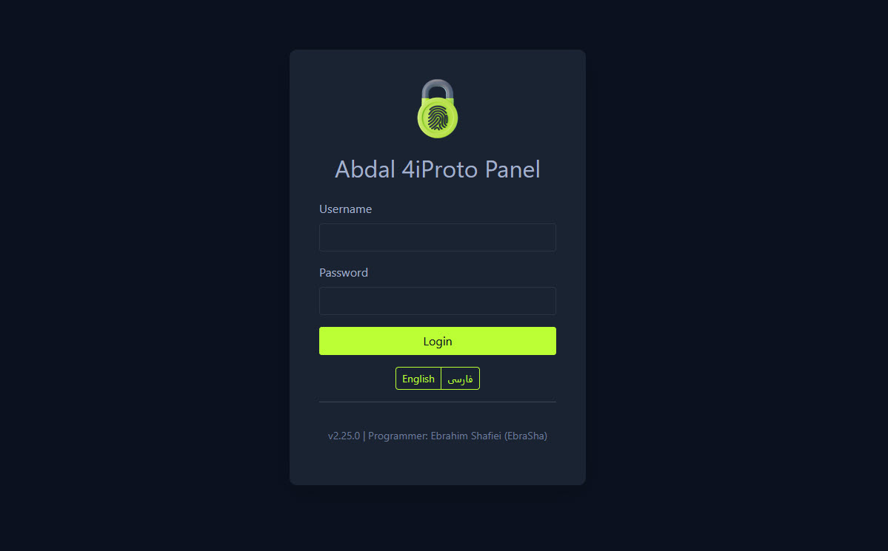
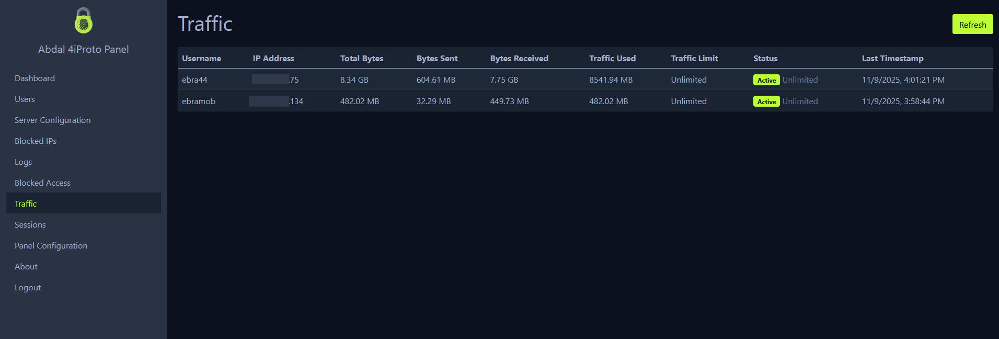

# پنل مدیریت Abdal 4iProto

 

<div align="right">
  
</div>

<div align="right">
  
</div>

## 📘 زبان‌های دیگر

- [🇬🇧 English - انگلیسی](README.md)

 

## 🎯 درباره

**پنل مدیریت Abdal 4iProto** یک رابط مدیریتی جامع مبتنی بر وب برای [سرور Abdal 4iProto](https://github.com/ebrasha/abdal-4iproto-server) است. این پنل به مدیران سیستم امکان مدیریت کامل کاربران، تنظیمات سرور، نظارت بر ترافیک، مدیریت سشن‌ها و لاگ‌های سیستم را از طریق یک رابط کاربری ساده و قابل استفاده فراهم می‌کند.

این پنل با زبان Go ساخته شده و از منابع جاسازی‌شده استفاده می‌کند، بنابراین یک فایل اجرایی واحد است که بدون هیچ پیش‌نیازی قابل اجرا است. پنل از سیستم‌عامل‌های Windows و Linux پشتیبانی می‌کند و می‌تواند به عنوان یک سرویس سیستم نصب شود.

## ✨ ویژگی‌ها

### مدیریت کاربران
- **عملیات CRUD کامل**: ایجاد، خواندن، به‌روزرسانی و حذف کاربران
- **پیکربندی کاربر**: مدیریت تنظیمات کاربر شامل:
  - نام کاربری و رمز عبور
  - تعیین نقش (مدیر/کاربر)
  - دامنه‌ها و IP های بلاک شده
  - محدودیت سشن و TTL
  - محدودیت سرعت (کیلوبایت بر ثانیه)
  - محدودیت ترافیک (مگابایت)
  - تنظیمات لاگ

### تنظیمات سرور
- **مدیریت پورت**: پیکربندی چندین پورت سرور
- **پیکربندی شل**: تنظیم شل پیش‌فرض برای Windows/Linux
- **تنظیمات احراز هویت**: پیکربندی حداکثر تلاش‌های احراز هویت
- **نسخه سرور**: سفارشی‌سازی signature/نسخه سرور

### ویژگی‌های امنیتی
- **بلاک IP**: مدیریت آدرس‌های IP بلاک شده
- **حفاظت در برابر Brute-Force**:
  - حداکثر تلاش‌های ورود قابل تنظیم
  - پنجره زمانی برای تلاش‌ها
  - مدت زمان بلاک قابل تنظیم
  - بلاک خودکار IP

### نظارت و لاگ
- **لاگ‌های برخط**: مشاهده لاگ‌های دسترسی کاربران با به‌روزرسانی Ajax
- **نظارت بر ترافیک**: نظارت بر مصرف ترافیک کاربران
  - آمار ترافیک برخط
  - ردیابی ترافیک بر اساس سشن و کل ترافیک
  - هشدارهای محدودیت ترافیک
- **مدیریت سشن**: مشاهده سشن‌های فعال سرور
  - شناسه سشن، نام کاربری، آدرس IP
  - نسخه کلاینت، زمان ایجاد، آخرین مشاهده

### تنظیمات پنل
- **تنظیمات پنل**: مدیریت پیکربندی پنل از طریق رابط وب
  - پیکربندی پورت
  - اطلاعات مدیر
  - تنظیمات لاگ
  - تنظیمات امنیتی
- **ریست خودکار**: سرویس پنل به طور خودکار بعد از تغییرات پیکربندی ریست می‌شود

### ویژگی‌های اضافی
- **پشتیبانی چندزبانه**: رابط کاربری انگلیسی و فارسی
- **طراحی واکنش‌گرا**: سازگار با موبایل با منوی همبرگری
- **پشتیبانی سرویس**: قابل اجرا به عنوان Windows Service یا Linux systemd service
- **منابع جاسازی‌شده**: تمام منابع (CSS, JS, قالب‌ها, ترجمه‌ها) جاسازی شده‌اند
- **بدون پیش‌نیاز**: یک فایل اجرایی واحد، بدون وابستگی خارجی

## 🚀 نصب


## 🚀 نصب آسان از طریق ابزار Abdal 4iProto Cli

پروژه [**Abdal 4iProto Cli**](https://github.com/ebrasha/abdal-4iproto-cli) یک ابزار پیشرفته خط فرمان برای مدیریت جامع اکوسیستم Abdal 4iProto است. این ابزار به طور خودکار مشخصات سیستم‌عامل و معماری پردازنده شما را تشخیص داده، اصالت فایل‌ها را با هش SHA-256 اعتبارسنجی می‌کند، پورت‌ها را تنظیم کرده و سرویس‌های سیستمی پایدار را ثبت می‌نماید.

 


## 🧩 فایل‌های الزامی برای نصب

فایل‌های زیر باید در کنار فایل اسکریپت نصب قرار داشته باشند:

abdal-4iproto-panel.json  
abdal_4iproto_panel_linux  
abdal_4iproto_server_linux  
blocked_ips.json  
id_ed25519  
id_ed25519.pub  
server_config.json  
users.json

🧠 نکته برای لینوکس:
دو فایل اصلی و اجرایی عبارتند از:
- abdal_4iproto_panel_linux — فایل اجرایی پنل مدیریت
- abdal_4iproto_server_linux — فایل اجرایی سرور 4iProto

🧠 نکته برای ویندوز:  
دو فایل اصلی و اجرایی عبارتند از:
- abdal-4iproto-panel-windows.exe — فایل اجرایی پنل مدیریت
- abdal-4iproto-server-windows.exe — فایل اجرایی سرور 4iProto


------------------------------------------------------------

## ⚙️ دستور نصب

کافی است فایل اسکریپت نصب را به همراه سایر فایل‌ها که در مسیر زیر قرار داده‌اید اجرا کنید:  
/usr/local/abdal-4iproto-server

chmod +x install-abdal-4iproto-panel.sh  
./install-abdal-4iproto-panel.sh

## ⚙️ دستور نصب در ویندوز
تمامی فایل‌ها را در یک پوشه ذخیره کنید، سپس فایل `install-abdal-4iproto-panel.bat` را با **دسترسی مدیر (Administrator)** اجرا کنید.


## 🧑‍💻 برای برنامه نویسان
### پیش‌نیازها

- Go 1.21 یا بالاتر (برای کامپایل از سورس)
- Windows 7+ یا سیستم Linux با systemd

### کامپایل از سورس

```bash
# کلون کردن مخزن
git clone https://github.com/ebrasha/abdal-4iproto-panel.git
cd abdal-4iproto-panel

# کامپایل فایل اجرایی
go build -o abdal-4iproto-panel main.go

# برای Windows
go build -o abdal-4iproto-panel.exe main.go
```

### دانلود فایل‌های اجرایی

فایل‌های اجرایی آخرین نسخه را از [صفحه Releases](https://github.com/ebrasha/abdal-4iproto-panel/releases) دانلود کنید.

## ⚙️ پیکربندی

### پیکربندی اولیه

پنل به طور خودکار فایل پیکربندی پیش‌فرض `abdal-4iproto-panel.json` را در اولین اجرا ایجاد می‌کند:

```json
{
  "port": 52202,
  "username": "ebrasha",
  "password": "ebrasha1309",
  "logging": true,
  "blocked_ips": [],
  "max_login_attempts": 5,
  "login_attempt_window": 300,
  "block_duration": 3600
}
```

 
### دسترسی به پنل

1. مرورگر وب خود را باز کنید
2. به آدرس `http://localhost:52202` (یا پورت پیکربندی شده) بروید
3. با اطلاعات ورود پیش‌فرض وارد شوید:
   - نام کاربری: `ebrasha`
   - رمز عبور: `ebrasha1309`

**⚠️ مهم:** رمز عبور پیش‌فرض را بلافاصله بعد از اولین ورود تغییر دهید!

### مدیریت پنل

تمام مدیریت از طریق رابط وب انجام می‌شود:

- **داشبورد**: نمای کلی کاربران، سشن‌ها و ترافیک
- **کاربران**: مدیریت حساب‌های کاربری و مجوزها
- **تنظیمات سرور**: پیکربندی سرور Abdal 4iProto
- **IP های بلاک شده**: مدیریت آدرس‌های IP بلاک شده
- **لاگ‌ها**: مشاهده لاگ‌های دسترسی کاربران
- **ترافیک**: نظارت بر مصرف ترافیک کاربران
- **سشن‌ها**: مشاهده سشن‌های فعال سرور
- **تنظیمات پنل**: مدیریت تنظیمات پنل
- **درباره ما**: اطلاعات درباره پنل و برنامه‌نویس

## 🤖 ربات تلگرام

پنل به همراه یک ربات تلگرام اختیاری ارائه می‌شود که تمام عملیات مدیریتی رابط وب را در تلگرام بازتولید می‌کند.

### فعال‌سازی ربات

۱. در تلگرام به `@BotFather` بروید، یک ربات جدید بسازید و توکن API را ذخیره کنید.  
۲. آیدی عددی تلگرام خود را از `@userinfobot` (یا هر ربات مشابه) دریافت کنید.  
۳. در پنل به بخش **Panel Configuration** بروید و تا قسمت **🤖 Telegram Bot** پایین بیایید.  
۴. گزینه **Enable Telegram bot** را تیک بزنید، توکن را وارد و آیدی‌های مدیران را با کاما، فاصله یا خطوط جدید از هم جدا کنید.  
۵. روی **Save** بزنید. سرویس پنل به صورت خودکار راه‌اندازی مجدد می‌شود و ربات شروع به polling از تلگرام می‌کند.

تنظیمات در فایل `abdal-4iproto-panel.json` زیر کلید `telegram_bot` ذخیره می‌شوند:

```json
"telegram_bot": {
  "enabled": true,
  "token": "123456789:AA...your-bot-token",
  "admins": [111111111, 222222222]
}
```

### مدل امنیتی

*   ربات هر پیامی که از طرف آیدی غیر مدیر بیاید را نادیده می‌گیرد و یک پاسخ کوتاه «دسترسی غیرمجاز» می‌دهد، تا حمله‌گر نتواند بدون اطلاع شما، ربات را بررسی کند.


### معماری و طراحی عملکردی

ربات به‌عنوان یک زیرسیستم کاملاً ایزوله درون پراسس پنل اجرا می‌شود. ربات از pool اختصاصی HTTP connection، pool جداگانه worker dispatcher، channel async برای لاگ و صف debounce برای راه‌اندازی مجدد سرویس استفاده می‌کند؛ بنابراین شلوغی رابط وب یا کندی I/O دیسک هیچ‌گاه نمی‌تواند ربات را کند کند. زنجیره end-to-end پردازش هر آپدیت به این شکل است:

```text
┌─────────────────────────┐      ┌──────────────────────┐
│ Telegram getUpdates     │ ───► │ updates channel      │
│ (1 goroutine)           │      │ (cap 1024)           │
└─────────────────────────┘      └──────────┬───────────┘
                                            │
                          ┌─────────────────┼─────────────────┐
                          ▼                 ▼                 ▼
                   ┌──────────┐      ┌──────────┐      ┌──────────┐
                   │ worker 1 │ ...  │ worker N │      │ worker N │ (NumCPU*2, ≥8)
                   └────┬─────┘      └────┬─────┘      └────┬─────┘
                        │                 │                 │
                        ▼ (go r(ctx,b,u)) ▼                 ▼
                   ┌────────────────────────────────────────────┐
                   │ Per-handler goroutine                       │
                   │  → trackerMiddleware (WaitGroup +1)         │
                   │  → adminOnly                                │
                   │  → recover                                  │
                   │  → handler (sendText via HTTP/2 conn pool)  │
                   └────────────────────────────────────────────┘
                        │
                        ▼ (svc.Info/Warning/Error)
                   ┌────────────────┐
                   │ async log chan │ ──► dedicated writer ──► panelLogger
                   │ (cap 1024)     │
                   └────────────────┘
```

### دستورات ربات

تمام دستورات از طریق `SetMyCommands` در منوی `/` کلاینت تلگرام هم ثبت می‌شوند.

| دستور | شرح |
| --- | --- |
| `/start` | شروع کار با ربات. مدیر در اولین اجرا گزینه انتخاب زبان (🇬🇧 / 🇮🇷) را می‌بیند. |
| `/menu` | باز کردن منوی اصلی (با دکمه «🏠 منوی اصلی» نیز در دسترس است). |
| `/language` | تغییر زبان بین فارسی و انگلیسی در هر زمان. |
| `/help` | نمایش فهرست کامل دستورات. |
| `/cancel` | لغو فرآیند تعاملی فعلی و بازگشت به منو. |
| `/users` | باز کردن لیست صفحه‌بندی‌شده کاربران. |
| `/adduser` | ایجاد کاربر با مقادیر پیش‌فرض (در ادامه ذکر شده است). |
| `/adduser_interactive` | ایجاد کاربر به صورت تعاملی و گام‌به‌گام. |
| `/server` | نمایش یا ویرایش فیلد به فیلد تنظیمات سرور. |
| `/blockedips` | مدیریت IPهای بلاک‌شده سراسری (مشاهده، افزودن، حذف). |
| `/logs` | مرور لاگ‌های دسترسی کاربران (آخرین ۲۰ خط هر کاربر). |
| `/blockedaccess` | مرور لاگ‌های دسترسی‌های بلاک‌شده. |
| `/traffic` | نمایش مصرف ترافیک هر کاربر. |
| `/sessions` | فهرست سشن‌های فعال و ابطال آن‌ها. |
| `/restart_server` | راه‌اندازی مجدد سرویس سرور Abdal 4iProto (همراه با تأیید). |
| `/restart_panel` | راه‌اندازی مجدد سرویس پنل (همراه با تأیید). |


### سرویس Windows

```cmd
# نصب سرویس
abdal-4iproto-panel.exe install

# شروع سرویس
abdal-4iproto-panel.exe start

# توقف سرویس
abdal-4iproto-panel.exe stop

# حذف سرویس
abdal-4iproto-panel.exe uninstall
```

### سرویس Linux Systemd

```bash
# اجرای اسکریپت نصب
sudo ./install-abdal-4iproto-panel.sh

# یا دستی
sudo systemctl start abdal-4iproto-panel
sudo systemctl enable abdal-4iproto-panel
sudo systemctl status abdal-4iproto-panel
```

 

## 🔗 لینک‌های پروژه

- **مخزن سرور**: [سرور Abdal 4iProto](https://github.com/ebrasha/abdal-4iproto-server)
- **مخزن پنل**: [پنل مدیریت Abdal 4iProto](https://github.com/ebrasha/abdal-4iproto-panel)


## 🐛 گزارش مشکلات
اگر با مشکلی مواجه شدید یا در پیکربندی مشکل دارید، لطفاً از طریق ایمیل Prof.Shafiei@Gmail.com با ما در تماس باشید. همچنین می‌توانید مشکلات را در GitHub گزارش دهید.

## ❤️ حمایت مالی
اگر این پروژه برای شما مفید بود و مایل به حمایت از توسعه بیشتر هستید، لطفاً در نظر داشته باشید که کمک مالی کنید:
- [اینجا اهدا کنید](https://alphajet.ir/abdal-donation)

## 🤵 برنامه‌نویس
ساخته شده با عشق توسط **ابراهیم شفیعی (EbraSha)**
- **ایمیل**: Prof.Shafiei@Gmail.com
- **تلگرام**: [@ProfShafiei](https://t.me/ProfShafiei)

## 📜 مجوز
این پروژه تحت مجوز GPLv2 or later منتشر شده است. 