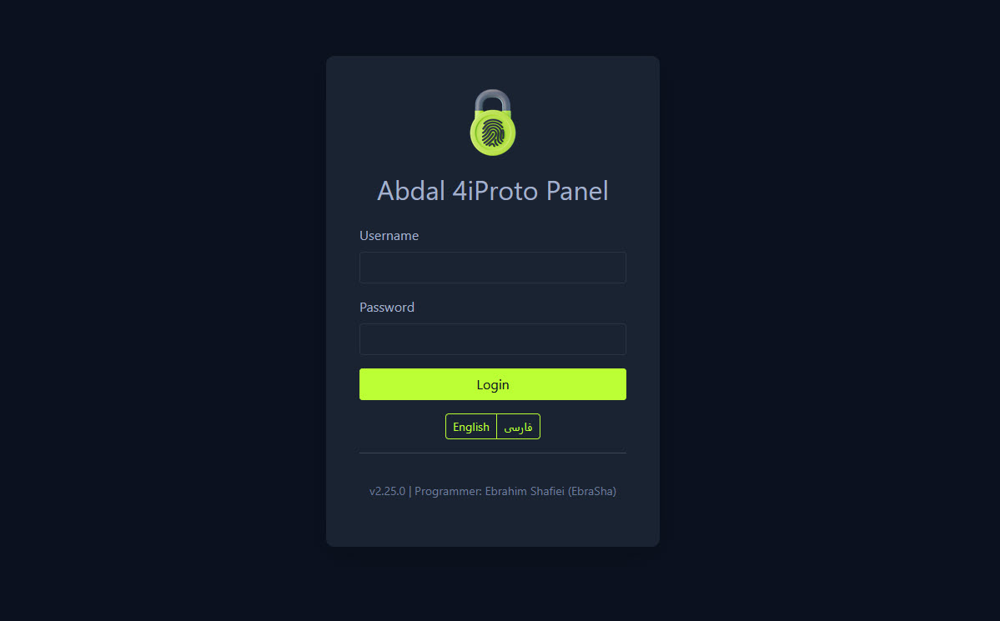
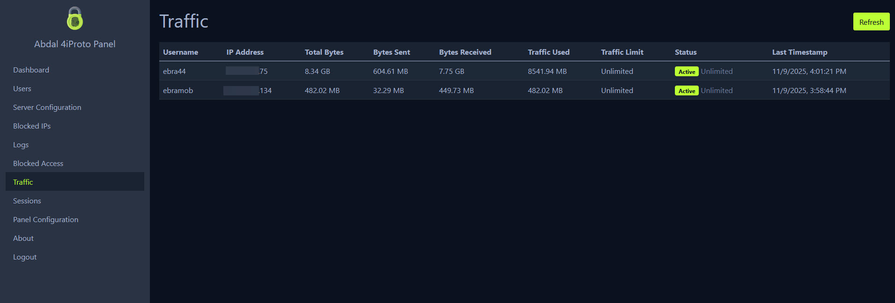

# Abdal 4iProto Panel


<div align="right">
  
</div>


<div align="right">
  
</div>

## 📘 Other Languages

- [🇮🇷 Persian - فارسی](README.fa.md)

 
## 🎯 About

**Abdal 4iProto Panel** is a comprehensive web-based management interface for the [Abdal 4iProto Server](https://github.com/ebrasha/abdal-4iproto-server). This panel provides administrators with a complete solution to manage users, server configuration, traffic monitoring, session management, and system logs through an intuitive web interface.

The panel is built with Go and uses embedded resources, making it a single executable file that can run without any prerequisites. It supports both Windows and Linux systems and can be installed as a system service.

## ✨ Features

### User Management
- **Complete CRUD Operations**: Create, read, update, and delete users
- **User Configuration**: Manage user settings including:
  - Username and password
  - Role assignment (admin/user)
  - Blocked domains and IPs
  - Session limits and TTL
  - Speed limits (KB/s)
  - Traffic limits (MB)
  - Logging preferences

### Server Configuration
- **Port Management**: Configure multiple server ports
- **Shell Configuration**: Set default shell for Windows/Linux
- **Authentication Settings**: Configure max authentication attempts
- **Server Version**: Customize server signature/version

### Security Features
- **IP Blocking**: Manage blocked IP addresses
- **Brute-Force Protection**: 
  - Configurable max login attempts
  - Time-based attempt window
  - Configurable block duration
  - Automatic IP blocking

### Monitoring & Logging
- **Real-time Logs**: View user access logs with Ajax updates
- **Traffic Monitoring**: Monitor user traffic consumption
  - Real-time traffic statistics
  - Session-based and total traffic tracking
  - Traffic limit warnings
- **Session Management**: View active sessions from the server
  - Session ID, username, IP address
  - Client version, creation time, last seen

### Panel Configuration
- **Panel Settings**: Manage panel configuration through web interface
  - Port configuration
  - Admin credentials
  - Logging preferences
  - Security settings
- **Auto-restart**: Panel service automatically restarts after configuration changes

### Additional Features
- **Multi-language Support**: English and Persian (Farsi) interface
- **Responsive Design**: Mobile-friendly with hamburger menu
- **Service Support**: Can run as Windows Service or Linux systemd service
- **Embedded Resources**: All assets (CSS, JS, templates, translations) are embedded
- **No Prerequisites**: Single executable file, no external dependencies

## 🚀 Installation

## 🧩 Required Files for Installation

The following files must be placed alongside the installation script:

abdal-4iproto-panel.json  
abdal_4iproto_panel_linux  
abdal_4iproto_server_linux  
blocked_ips.json  
id_ed25519  
id_ed25519.pub  
server_config.json  
users.json

🧠 Note for linux:  
The two executable core files are:
- abdal_4iproto_panel_linux — The management panel executable
- abdal_4iproto_server_linux — The 4iProto server executable

🧠 Note for windows:  
The two main executable files are:
- abdal-4iproto-panel-windows.exe — The management panel executable
- abdal-4iproto-server-windows.exe — The 4iProto server executable

------------------------------------------------------------

## ⚙️ Linux Installation Command

Simply execute the installation script along with the required files located in the path:
/usr/local/abdal-4iproto-server

chmod +x install-abdal-4iproto-panel.sh  
./install-abdal-4iproto-panel.sh

## ⚙️ Windows Installation Command
Store all files in a single directory, then run the `install-abdal-4iproto-panel.bat` file **with Administrator privileges**.


## 🧑‍💻 For developers


### Prerequisites

- Go 1.21 or later (for building from source)
- Windows 7+ or Linux system with systemd

### Build from Source

```bash
# Clone the repository
git clone https://github.com/ebrasha/abdal-4iproto-panel.git
cd abdal-4iproto-panel

# Build the executable
go build -o abdal-4iproto-panel main.go

# For Windows
go build -o abdal-4iproto-panel.exe main.go
```

### Download Pre-built Binaries

Download the latest release from the [Releases](https://github.com/ebrasha/abdal-4iproto-panel/releases) page.

## ⚙️ Configuration

### Initial Configuration

The panel creates a default configuration file `abdal-4iproto-panel.json` on first run:

```json
{
  "port": 52202,
  "username": "ebrasha",
  "password": "ebrasha1309",
  "logging": true,
  "blocked_ips": [],
  "max_login_attempts": 5,
  "login_attempt_window": 300,
  "block_duration": 3600
}
```

 
### Accessing the Panel

1. Open your web browser
2. Navigate to `http://localhost:52202` (or the configured port)
3. Login with default credentials:
   - Username: `ebrasha`
   - Password: `ebrasha1309`

**⚠️ Important:** Change the default password immediately after first login!

### Managing the Panel

All management is done through the web interface:

- **Dashboard**: Overview of users, sessions, and traffic
- **Users**: Manage user accounts and permissions
- **Server Configuration**: Configure the Abdal 4iProto Server
- **Blocked IPs**: Manage blocked IP addresses
- **Logs**: View user access logs
- **Traffic**: Monitor user traffic consumption
- **Sessions**: View active server sessions
- **Panel Configuration**: Manage panel settings
- **About**: Information about the panel and programmer

## 🔧 Service Installation

The panel can be installed as a system service for automatic startup and background operation.

### Windows Service

```cmd
# Install the service
abdal-4iproto-panel.exe install

# Start the service
abdal-4iproto-panel.exe start

# Stop the service
abdal-4iproto-panel.exe stop

# Uninstall the service
abdal-4iproto-panel.exe uninstall
```

### Linux Systemd Service

```bash
# Run the installation script
sudo ./install-abdal-4iproto-panel.sh

# Or manually
sudo systemctl start abdal-4iproto-panel
sudo systemctl enable abdal-4iproto-panel
sudo systemctl status abdal-4iproto-panel
```
 

## 🔗 Project Links

- **Server Repository**: [Abdal 4iProto Server](https://github.com/ebrasha/abdal-4iproto-server)
- **Panel Repository**: [Abdal 4iProto Panel](https://github.com/ebrasha/abdal-4iproto-panel)

## 🐛 Reporting Issues
If you encounter any issues or have configuration problems, please reach out via email at Prof.Shafiei@Gmail.com. You can also report issues on GitHub.

## ❤️ Donation
If you find this project helpful and would like to support further development, please consider making a donation:
- [Donate Here](https://ebrasha.com/abdal-donation)

## 🤵 Programmer
Handcrafted with Passion by **Ebrahim Shafiei (EbraSha)**
- **E-Mail**: Prof.Shafiei@Gmail.com
- **Telegram**: [@ProfShafiei](https://t.me/ProfShafiei)

## 📜 License
This project is licensed under the GPLv2 or later License. 